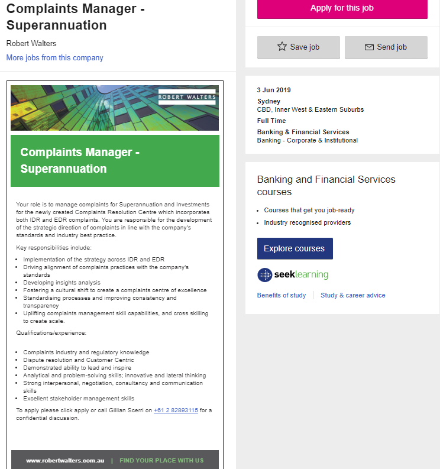

My Ideal Job

Job advertisement Itself: 
https://www.seek.com.au/job/39165301?searchrequesttoken=84d123da-e22b-40fd-b98e-e4b5afc08460&type=standard

	
What makes this position appealing to you and what does it involve? 

This position involves handling a large number of complaints that have been escalated beyond the contact centres in which they started. The successful applicant would need to investigate complex cases within a large organisation, often spanning across multiple divisions or departments. They would also have to correspond with the complainants to reach a positive resolution, while also working to adhere to financial and business rules and regulations. Additionally, they would affect long term change by identifying and seeking to change business practises to reduce dissatisfaction in the future. 
I am currently working for a large superannuation industry fund, in which a large part of my role is communicating with customers about their funds with us. The part of this job I enjoy the most is helping the people I talk to resolve the issues they are faced with. This often involves investigating why they are upset, understanding what occurred and then seeking to implement a resolution. Helping people has always interested me, and this role is a natural extension of my current job. 
This complaints manager role would allow me to assist a large number of individuals, while also working to change business strategies and affect long term change. Having enjoyed working in many customer facing roles in superannuation, I feel that this job most closely aligns with both my personal goals and corporate ambitions. 

A description of the skills, qualifications, and experience required for the position. 
This role requires a range of different skills and experience, as it is both dealing with internal and external stakeholders. The ideal candidate would certainly have to possess strong experience in customer service. A key part of the job would be communicating with dissatisfied customers – so being able to effectively engage with all kinds of people would be essential. Additionally, the candidate would need to have excellent time management and organisational skills. With a large case of complaints, and a range of teams to liaise with in their resolution, time management would be critical. 
While experience in a similar dispute resolution position would be great, general experience in a customer orientated or investigative role would be more important. If a tertiary qualification was required, a bachelors of business or finance would be the most applicable considering the nature of the product.  

A description of the skills, qualifications and experience I currently have 

I first started working in a customer facing environment in hospitality. I worked in a fast food chain, in which I would often take and deliver orders to a range of different people. From there I secured a job with a large bank, where I worked in an inbound call centre for superannuation. This position was vastly wide-ranging, and involved me doing anything from resetting online passwords, to educating customers of taxation legislation around contributions into super. 
After working for nearly a year in that position, I moved into another superfund in a similar, role in which I also perform administrative duties. This includes taking escalations from colleagues when they have an upset customer, and investigating complex or difficult cases.
Currently I am studying a Bachelor of Business with RMIT and Open Universities; this will be my first post high school education. 

 A plan describing how you will obtain the skills, qualifications and experience required for the position. 
I feel that due to having over two years’ experience in a similar customer orientated role within superannuation, that this position is quite obtainable. Firstly, I plan to continue developing in my current job. This will involve spending more time investigating and escalating complex or difficult cases, and working with colleagues and customers alike to resolve them. 
In addition to that, I plan on continuing to study my degree in business at home in my free time. This will give me both a tertiary qualification, and experience in business and finance overall. It will also teach me to use different programs and IT systems I would not otherwise know how to use. For instance, my current unit: Statistical Analysis relies heavily on using the program Excel. 
Other than that, I will strive to increasingly take on more responsibility at work, and look for more opportunities to excel at my current position. 
