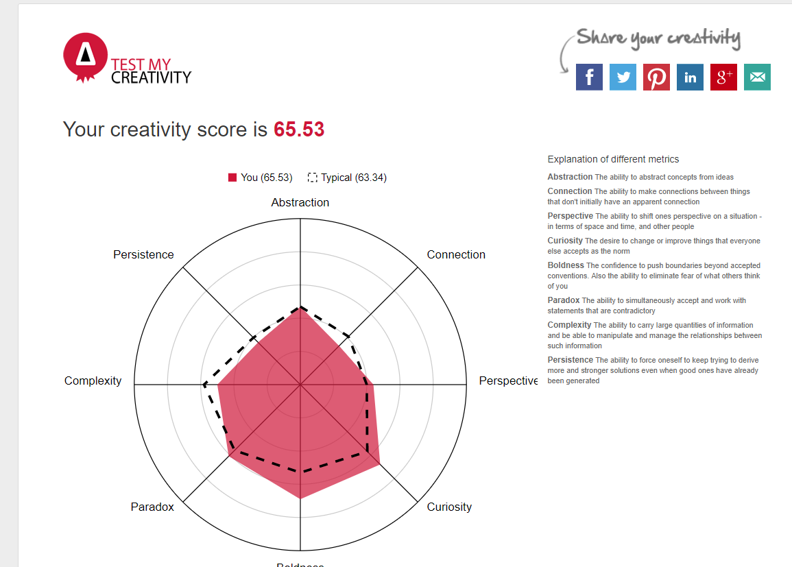

**Who am I according to some tests**

Myers Briggs Test
(Source 1: 16 Personalities) 

Learning style Test: 

 
(Source 2: What’s your learning style?) 

Creativity Test 

 
(Source 3: Test my Creativity) 

What do the results of the test mean to you? 

While some of these test results are surprising, for the most part they mainly reinforce what I already knew about myself. I have always been more of an introvert, and in most large social situations have sought to isolate myself. The Myer-Briggs test I felt was particularly accurate in that it defined many of my personality traits and creative style. The test’s explanation of me as an advocate also helped me understand more about myself and some of the things I have thought but struggled to word in the past. Particularly, in that while I try my best to help others, I can also be sensitive to others criticisms and thought, and too idealistic. The Myer-Briggs test also classified me as easy to burn out, and always looking for a cause. These weaknesses identified by the test resonated with me. In the past I have often avoided or put off routine duties to focus fully on what I consider are concrete steps towards my goal. This has led me on multiple occasions to burn out and give up on something I had been trying to perfect. 
The online learning test was the biggest surprise for me. I have never considered my preferred style of learning, but before taking this test I would have guessed auditory. I often enjoy listening to books and podcasts, rather than reading or watching lectures. However the test classed me quite strongly as visual. I am not sure if I fully agree with this assessment but will seek to identify my best learning strategies in the future with experience. 
The creativity test showed the most expected results, ranking me above average in creativity. I have often been told growing up that I was quite creative, and this test confirmed those comments. However, it was interesting to explore the sub categories of creativity and where most people and myself ranked. 

Sources: 
1.	16 Personalities, 2019, Free Personality Test, 16 Personalities, viewed on the 12/06/2019 https://www.16personalities.com/

2.	Education Planner, 2019, What’s your learning style? 20 Questions, Education Planner, viewed on the 12/06/2019, http://www.educationplanner.org/students/self-assessments/learning-styles-quiz.shtml

3.	Test My Creativity, 2019, Test My Creativity, Aulive, Viewed on the 12/06/2019 http://www.aulive.com/ 
